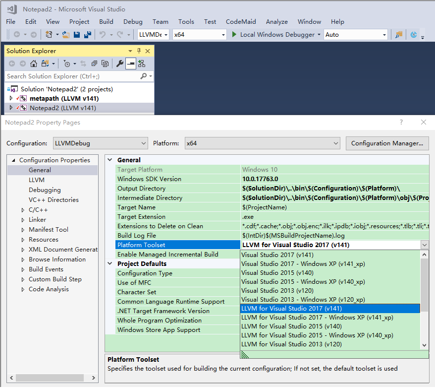

# LLVM Utils

## LLVM for Visual Studio 2017, 2019 and 2022
### Installation
Please download and install LLVM from https://github.com/llvm/llvm-project/releases, https://releases.llvm.org/ or https://llvm.org/builds/.

`VS2017\install.bat` can be used to install MSBuild script for Visual Studio 2017, 2019 and 2022. (may require Administrator privilege. In Windows 8 or later, you can quickly open an elevated PowerShell prompt by File -> Open Windows PowerShell -> Open PowerShell as Administrator).

### Visual Studio 2022
The Platform Toolset is "LLVM for Visual Studio 2022 (`LLVM_v143`)", "LLVM for Visual Studio 2019 (`LLVM_v142`)", "LLVM for Visual Studio 2017 (`LLVM_v141`)" and  "LLVM for Visual Studio 2017 - Windows XP (`LLVM_v141_xp`)".

Assume `VS_PATH` is your Visual Studio 2020 installation path (e.g: `C:\Program Files\Microsoft Visual Studio\2022\Community`), please manually copy folders under `VS2017` to their target paths.

| Folder | Target Path |
|------|-------------|
|`VS2017\LLVM` | `%VS_PATH%\MSBuild\Microsoft\VC\v170\` |
|`VS2017\LLVM_v143` | `%VS_PATH%\MSBuild\Microsoft\VC\v170\Platforms\x64\PlatformToolsets\` |
|`VS2017\LLVM_v143` | `%VS_PATH%\MSBuild\Microsoft\VC\v170\Platforms\Win32\PlatformToolsets\` |
|`VS2017\LLVM_v143` | `%VS_PATH%\MSBuild\Microsoft\VC\v170\Platforms\ARM64\PlatformToolsets\` |
|`VS2017\LLVM_v143` | `%VS_PATH%\MSBuild\Microsoft\VC\v170\Platforms\ARM\PlatformToolsets\` |
|`VS2017\LLVM` | `%VS_PATH%\MSBuild\Microsoft\VC\v160\` |
|`VS2017\LLVM_v142` | `%VS_PATH%\MSBuild\Microsoft\VC\v160\Platforms\x64\PlatformToolsets\` |
|`VS2017\LLVM_v142` | `%VS_PATH%\MSBuild\Microsoft\VC\v160\Platforms\Win32\PlatformToolsets\` |
|`VS2017\LLVM_v142` | `%VS_PATH%\MSBuild\Microsoft\VC\v160\Platforms\ARM64\PlatformToolsets\` |
|`VS2017\LLVM_v142` | `%VS_PATH%\MSBuild\Microsoft\VC\v160\Platforms\ARM\PlatformToolsets\` |
|`VS2017\LLVM` | `%VS_PATH%\MSBuild\Microsoft\VC\v150\` |
|`VS2017\LLVM_v141` | `%VS_PATH%\MSBuild\Microsoft\VC\v150\Platforms\x64\PlatformToolsets\` |
|`VS2017\LLVM_v141_xp` | `%VS_PATH%\MSBuild\Microsoft\VC\v150\Platforms\x64\PlatformToolsets\` |
|`VS2017\LLVM_v141` | `%VS_PATH%\MSBuild\Microsoft\VC\v150\Platforms\Win32\PlatformToolsets\` |
|`VS2017\LLVM_v141_xp` | `%VS_PATH%\MSBuild\Microsoft\VC\v150\Platforms\Win32\PlatformToolsets\` |
|`VS2017\LLVM_v141` | `%VS_PATH%\MSBuild\Microsoft\VC\v150\Platforms\ARM64\PlatformToolsets\` |
|`VS2017\LLVM_v141` | `%VS_PATH%\MSBuild\Microsoft\VC\v150\Platforms\ARM\PlatformToolsets\` |

### Visual Studio 2019
The Platform Toolset is "LLVM for Visual Studio 2019 (`LLVM_v142`)", "LLVM for Visual Studio 2017 (`LLVM_v141`)" and  "LLVM for Visual Studio 2017 - Windows XP (`LLVM_v141_xp`)".

Assume `VS_PATH` is your Visual Studio 2019 installation path (e.g: `C:\Program Files (x86)\Microsoft Visual Studio\2019\Community`), please manually copy folders under `VS2017` to their target paths.

| Folder | Target Path |
|------|-------------|
|`VS2017\LLVM` | `%VS_PATH%\MSBuild\Microsoft\VC\v160\` |
|`VS2017\LLVM_v142` | `%VS_PATH%\MSBuild\Microsoft\VC\v160\Platforms\x64\PlatformToolsets\` |
|`VS2017\LLVM_v142` | `%VS_PATH%\MSBuild\Microsoft\VC\v160\Platforms\Win32\PlatformToolsets\` |
|`VS2017\LLVM_v142` | `%VS_PATH%\MSBuild\Microsoft\VC\v160\Platforms\ARM64\PlatformToolsets\` |
|`VS2017\LLVM_v142` | `%VS_PATH%\MSBuild\Microsoft\VC\v160\Platforms\ARM\PlatformToolsets\` |
|`VS2017\LLVM` | `%VS_PATH%\MSBuild\Microsoft\VC\v150\` |
|`VS2017\LLVM_v141` | `%VS_PATH%\MSBuild\Microsoft\VC\v150\Platforms\x64\PlatformToolsets\` |
|`VS2017\LLVM_v141_xp` | `%VS_PATH%\MSBuild\Microsoft\VC\v150\Platforms\x64\PlatformToolsets\` |
|`VS2017\LLVM_v141` | `%VS_PATH%\MSBuild\Microsoft\VC\v150\Platforms\Win32\PlatformToolsets\` |
|`VS2017\LLVM_v141_xp` | `%VS_PATH%\MSBuild\Microsoft\VC\v150\Platforms\Win32\PlatformToolsets\` |
|`VS2017\LLVM_v141` | `%VS_PATH%\MSBuild\Microsoft\VC\v150\Platforms\ARM64\PlatformToolsets\` |
|`VS2017\LLVM_v141` | `%VS_PATH%\MSBuild\Microsoft\VC\v150\Platforms\ARM\PlatformToolsets\` |

### Visual Studio 2017
The Platform Toolset is "LLVM for Visual Studio 2017 (`LLVM_v141`)" and "LLVM for Visual Studio 2017 - Windows XP (`LLVM_v141_xp`)".

Assume `VS_PATH` is your Visual Studio 2017 installation path (e.g: `C:\Program Files (x86)\Microsoft Visual Studio\2017\Community`), please manually copy folders under `VS2017` to their target paths.

| Folder | Target Path |
|------|-------------|
|`VS2017\LLVM` | `%VS_PATH%\Common7\IDE\VC\VCTargets\` |
|`VS2017\LLVM_v141` | `%VS_PATH%\Common7\IDE\VC\VCTargets\Platforms\x64\PlatformToolsets\` |
|`VS2017\LLVM_v141_xp` | `%VS_PATH%\Common7\IDE\VC\VCTargets\Platforms\x64\PlatformToolsets\` |
|`VS2017\LLVM_v141` | `%VS_PATH%\Common7\IDE\VC\VCTargets\Platforms\Win32\PlatformToolsets\` |
|`VS2017\LLVM_v141_xp` | `%VS_PATH%\Common7\IDE\VC\VCTargets\Platforms\Win32\PlatformToolsets\` |
|`VS2017\LLVM_v141` | `%VS_PATH%\Common7\IDE\VC\VCTargets\Platforms\ARM64\PlatformToolsets\` |
|`VS2017\LLVM_v141` | `%VS_PATH%\Common7\IDE\VC\VCTargets\Platforms\ARM\PlatformToolsets\` |

## LLVM for Visual Studio 2010, 2012, 2013 and 2015
Assume `MB_PATH` is the MSBuild path for Visual C++ (e.g.: `C:\Program Files (x86)\MSBuild\Microsoft.Cpp\v4.0` or `C:\Program Files\MSBuild\Microsoft.Cpp\v4.0`), please manually copy `VS2017\LLVM` and related folders under `VS2015` to their target paths.

`VS2015\install.bat` (based on install script for [LLVM 6.0.1](https://releases.llvm.org/download.html#6.0.1)) can be used to install MSBuild script for Visual Studio 2010, 2012, 2013 and 2015.

### Visual Studio 2015
The Platform Toolset is "LLVM for Visual Studio 2015 (`LLVM_v140`)" and "LLVM for Visual Studio 2015 - Windows XP (`LLVM_v140_xp`)".

| Folder | Target Path |
|------|-------------|
|`VS2017\LLVM` | `%MB_PATH%\V140\` |
|`VS2015\LLVM_v140` | `%MB_PATH%\V140\Platforms\x64\PlatformToolsets\` |
|`VS2015\LLVM_v140_xp` | `%MB_PATH%\V140\Platforms\x64\PlatformToolsets\` |
|`VS2015\LLVM_v140` | `%MB_PATH%\V140\Platforms\Win32\PlatformToolsets\` |
|`VS2015\LLVM_v140_xp` | `%MB_PATH%\V140\Platforms\Win32\PlatformToolsets\` |

### Visual Studio 2013
The Platform Toolset is "LLVM for Visual Studio 2013 (`LLVM_v120`)" and "LLVM for Visual Studio 2013 - Windows XP (`LLVM_v120_xp`)".

| Folder | Target Path |
|------|-------------|
|`VS2017\LLVM` | `%MB_PATH%\v120\` |
|`VS2015\LLVM_v120` | `%MB_PATH%\v120\Platforms\x64\PlatformToolsets\` |
|`VS2015\LLVM_v120_xp` | `%MB_PATH%\v120\Platforms\x64\PlatformToolsets\` |
|`VS2015\LLVM_v120` | `%MB_PATH%\v120\Platforms\Win32\PlatformToolsets\` |
|`VS2015\LLVM_v120_xp` | `%MB_PATH%\v120\Platforms\Win32\PlatformToolsets\` |

### Visual Studio 2012
The Platform Toolset is "LLVM for Visual Studio 2012 (`LLVM_v110`)" and "LLVM for Visual Studio 2012 - Windows XP (`LLVM_v110_xp`)".

| Folder | Target Path |
|------|-------------|
|`VS2017\LLVM` | `%MB_PATH%\v110\` |
|`VS2015\x64\LLVM_v110` | `%MB_PATH%\v110\Platforms\x64\PlatformToolsets\` |
|`VS2015\x64\LLVM_v110_xp` | `%MB_PATH%\v110\Platforms\x64\PlatformToolsets\` |
|`VS2015\Win32\LLVM_v110` | `%MB_PATH%\v110\Platforms\Win32\PlatformToolsets\` |
|`VS2015\Win32\LLVM_v110_xp` | `%MB_PATH%\v110\Platforms\Win32\PlatformToolsets\` |

### Visual Studio 2010
The Platform Toolset is "LLVM for Visual Studio 2010 (`LLVM_v100`)" and "LLVM for Visual Studio 2008 (`LLVM_v90`)".

| Folder | Target Path |
|------|-------------|
|`VS2017\LLVM` | `%MB_PATH%\` |
|`VS2015\x64\LLVM_v100` | `%MB_PATH%\Platforms\x64\PlatformToolsets\` |
|`VS2015\x64\LLVM_v90` | `%MB_PATH%\Platforms\x64\PlatformToolsets\` |
|`VS2015\Win32\LLVM_v100` | `%MB_PATH%\Platforms\Win32\PlatformToolsets\` |
|`VS2015\Win32\LLVM_v90` | `%MB_PATH%\Platforms\Win32\PlatformToolsets\` |

## Install to AppVeyor or GitHub Actions Build Image
### Install LLVM on the build image

	curl -fsSL -o "LLVM-15.0.0-win64.exe" "https://github.com/llvm/llvm-project/releases/download/llvmorg-15.0.0/LLVM-15.0.0-win64.exe"
	LLVM-15.0.0-win64.exe /S

### Install from release archives

| Archive Name | Visual Studio Version |
|------|-------------|
| LLVM_VS2017.zip | 2017, 2019 and 2022 |
| LLVM_VS2010_2015.zip | 2010, 2012, 2013 and 2015 |
| LLVM_VS2015.zip | 2015 |
| LLVM_VS2013.zip | 2013 |
| LLVM_VS2012.zip | 2012 |
| LLVM_VS2010.zip | 2010 |

Examples:

	curl -fsSL -o "LLVM_VS2017.zip" "https://github.com/zufuliu/llvm-utils/releases/download/v22.09/LLVM_VS2017.zip"
	7z x -y "LLVM_VS2017.zip" >NUL
	CALL "LLVM_VS2017\install.bat" 1

	curl -fsSL -o "LLVM_VS2010_2015.zip" "https://github.com/zufuliu/llvm-utils/releases/download/v22.09/LLVM_VS2010_2015.zip"
	7z x -y "LLVM_VS2010_2015.zip" >NUL
	CALL "LLVM_VS2010_2015\install.bat" 1

### Install from latest main source code

	curl -fsSL -o "llvm-utils-main.zip" "https://github.com/zufuliu/llvm-utils/archive/main.zip"
	7z x -y "llvm-utils-main.zip" >NUL
	CALL "llvm-utils-main\VS2017\install.bat" 1
	CALL "llvm-utils-main\VS2015\install.bat" 1

or

	git clone -q --depth=1 --branch=main https://github.com/zufuliu/llvm-utils.git c:\projects\llvm-utils
	CALL "c:\projects\llvm-utils\VS2017\install.bat" 1
	CALL "c:\projects\llvm-utils\VS2015\install.bat" 1

## clang-cl for Python 3 distutils
See `clang\clang-cl-py3.diff` for the changes on hwo to use clang-cl as distutils compiler.
After apply these changes, you can build your extension with

	python setup.py build --compiler=clang-cl

## LLVM Windows Symbolic Link Maker
The huge size of LLVM Windows installation can be reduced dramatically by using Windows symbolic link (see [mklink command](https://docs.microsoft.com/en-us/windows-server/administration/windows-commands/mklink).

### Usage
Just copy `llvm\llvm-link.bat` to LLVM installation path (e.g.: `C:\Program Files\LLVM\`), and run it (may require Administrator privilege).

## Related Links
* [LLVM Extensions for Visual Studio 2017](https://marketplace.visualstudio.com/items?itemName=LLVMExtensions.llvm-toolchain) in Visual Studio Marketplace, [not works for Visual Studio 2019 alone](https://github.com/llvm/llvm-project/issues/41293).
* Original source for MSBuild

	https://github.com/llvm/llvm-project/tree/main/llvm/tools/msbuild

	svn co https://github.com/llvm/llvm-project/trunk/llvm/tools/msbuild msbuild

	svn co https://llvm.org/svn/llvm-project/llvm/trunk/tools/msbuild msbuild

* Outdated [LLVM for Visual Studio 2017](https://github.com/WubbaLubba/LlvmForVS2017) by @WubbaLubba
* [Failed to find MSBuild toolsets directory](https://github.com/llvm/llvm-project/issues/33019) in LLVM Bugzilla
